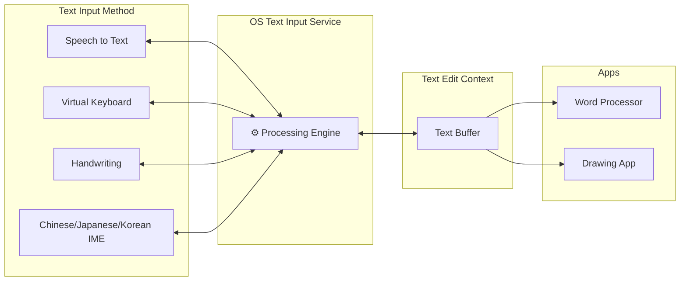

Created a comprehensive analytics dashboard for visualizing business metrics. Built with Next.js and D3.js for highly customizable, interactive charts including line graphs, bar charts, pie charts, and heatmaps. Users can filter data by date range, category, and custom dimensions. Supports exporting reports as CSV or PDF. The backend uses PostgreSQL for data storage and Redis for caching frequently accessed queries.

