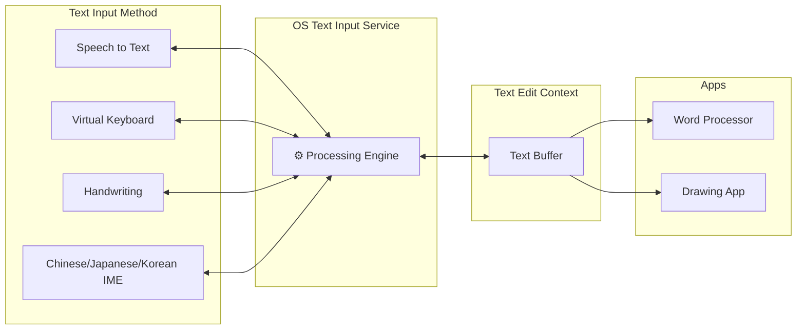

The [EditContext API](https://developer.mozilla.org/en-US/docs/Web/API/EditContext_API) is a web platform API that allows applications to take full control of text input. Traditional web editors rely on hidden `contenteditable` elements or `<textarea>` hacks to receive input from the operating system — but these approaches are fragile and break down with complex input methods like Chinese/Japanese/Korean (CJK) IMEs, handwriting recognition, and speech-to-text. The EditContext API provides a direct bridge between the OS text input services and the application, enabling rich text editors like VS Code to handle composition events, selection, and text updates natively — without relying on DOM elements for input.




## Basic Usage

To use the EditContext API, you create an `EditContext` instance and attach it to a DOM element via `editContext`:

```typescript
// Create an EditContext with initial text and selection
const editContext = new EditContext({
  text: '',
  selectionStart: 0,
  selectionEnd: 0,
});

// Attach it to a canvas or any DOM element
const editorElement = document.querySelector('#editor');
editorElement.editContext = editContext;
```

Once attached, the element no longer needs to be `contenteditable` — the `EditContext` handles all OS-level text input directly.

## Event Listeners

The EditContext API exposes several events for reacting to input changes:

- **`textupdate`** — Fired when the OS inserts, deletes, or replaces text. Provides the new text, the range being replaced, and the new selection.
- **`textformatupdate`** — Fired when the IME applies decorations (e.g. underline during composition). Provides a list of format ranges with `underlineStyle`, `underlineThickness`, and colors.
- **`characterboundsupdate`** — Fired when the OS needs the bounding rectangles of specific characters (for IME candidate window positioning).
- **`compositionstart`** — Fired when an IME composition session begins.
- **`compositionend`** — Fired when an IME composition session ends.

```typescript
editContext.addEventListener('textupdate', (e: TextUpdateEvent) => {
  const { updateRangeStart, updateRangeEnd, text, selectionStart, selectionEnd } = e;
  // Replace the text in [updateRangeStart, updateRangeEnd) with `text`
  // Then update selection to [selectionStart, selectionEnd)
});

editContext.addEventListener('textformatupdate', (e: TextFormatUpdateEvent) => {
  const formats: TextFormat[] = e.getTextFormats();
  for (const fmt of formats) {
    // fmt.rangeStart, fmt.rangeEnd
    // fmt.underlineStyle: 'none' | 'solid' | 'dotted' | 'dashed' | 'wavy'
    // fmt.underlineThickness: 'none' | 'thin' | 'thick'
  }
});

editContext.addEventListener('characterboundsupdate', (e: CharacterBoundsUpdateEvent) => {
  const { rangeStart, rangeEnd } = e;
  // Compute DOMRect for each character in [rangeStart, rangeEnd)
  const bounds: DOMRect[] = computeBounds(rangeStart, rangeEnd);
  editContext.updateCharacterBounds(rangeStart, bounds);
});

editContext.addEventListener('compositionstart', () => {
  // Composition has started (e.g. user began typing in an IME)
});

editContext.addEventListener('compositionend', () => {
  // Composition has ended, final text was committed
});
```

## Key Types

| Type | Description |
|---|---|
| `EditContext` | The main interface — holds text buffer, selection, and control/selection bounds |
| `TextUpdateEvent` | Carries `updateRangeStart`, `updateRangeEnd`, `text`, `selectionStart`, `selectionEnd` |
| `TextFormatUpdateEvent` | Provides `getTextFormats()` returning an array of `TextFormat` |
| `TextFormat` | Describes IME decoration: `rangeStart`, `rangeEnd`, `underlineStyle`, `underlineThickness` |
| `CharacterBoundsUpdateEvent` | Requests character bounds for range `[rangeStart, rangeEnd)` |

The application is responsible for calling these methods to keep the EditContext in sync with its internal model:

- **`updateText(start, end, newText)`** — Notify the OS that text changed programmatically
- **`updateSelection(start, end)`** — Update the current selection range
- **`updateControlBounds(rect)`** — Set the bounding box of the editor element
- **`updateSelectionBounds(rect)`** — Set the bounding box of the current selection
- **`updateCharacterBounds(start, bounds[])`** — Provide character-level bounding rectangles
